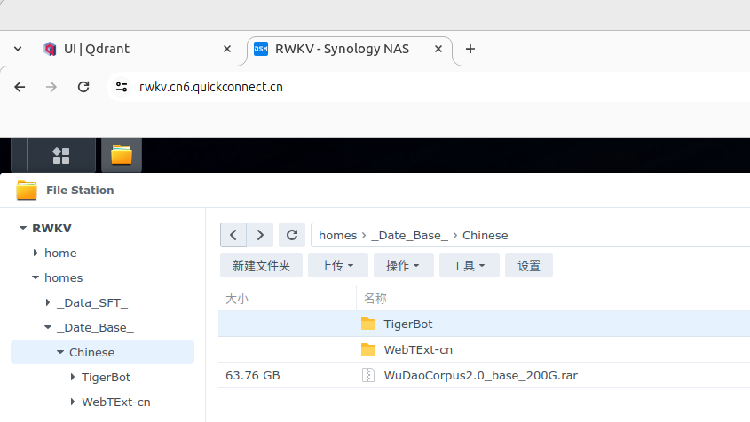
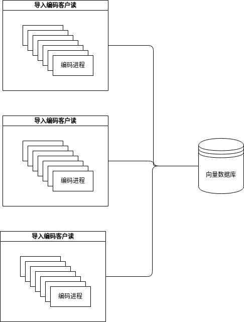

# 数据集过滤柳城

## 为每一个数据集创建一个向量数据库

即为每一个数据集创建一个映射目录，用于存储该数据集的向量和原文。
目前三个中文数据集需要过滤：

过滤优先级为：
- Wudao
- WebTExt-cn
- Tigerbot

后续Skypile下载完，比Tigerbot的优先级更高。

## 多机器对文本进行编码导入数据库

1. 把数据集文件分散到各个机器。
2. 在各个机器再把文件切割分配给不同进程。
3. 多进程，多机器导入到向量数据库。

## 多机器去重

1. 在多台机器上对全量uuid寻找超过阈值的相似文档。
2. 由于计算阈值是幂等操作，对互相相似的文档，全局保留其中一个（可由不同策略控制，如最先出现，最长等）。
3. 导出所有不重复的uuid成新的干净文档。
4. 把去掉重的文档导出到版本目录，供前端查看人为查阅，为下一个版本提供更多策略。