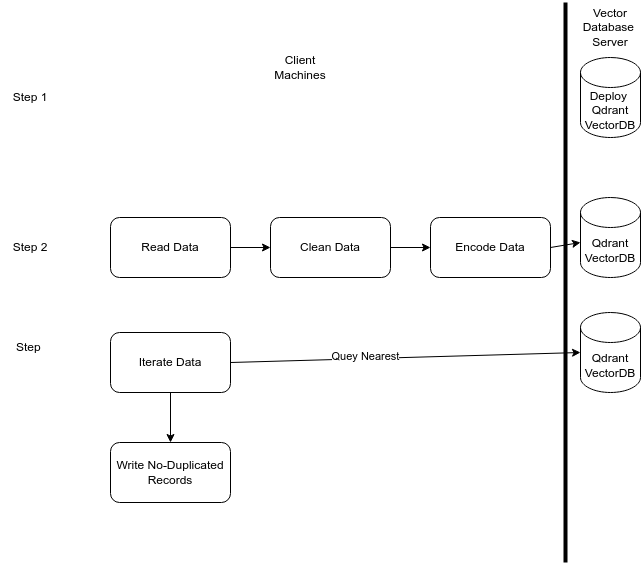
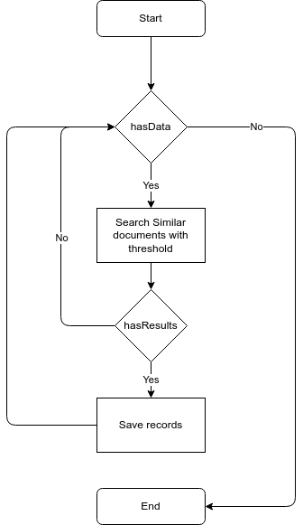
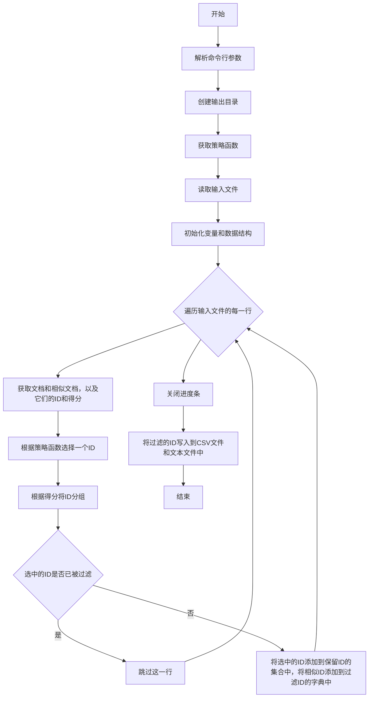

# 文本去重设计和计划

## 文本去重目标

- 清理文本特殊字符
- 长文本分割
- 文本去重

## 开发方案和计划

| 内容 | 方案 | 计划完成时间 |  状态 |
| ---- | ---- | ------------ | ---|
| 清理文本特殊字符 | Unstructed IO Clean接口 | 2022-04-09 |Done
| 文本去重 | Embeddings model for short texts| 2022-04-13| 90%
| 去重Pipeplien| File in File Out | 2022-04-15| 70%

## VDB store

### ChromaDB
 It's an embedded vectordb and suitable for testing and prototype

### qdrant
It's a massive production ready vectordb with high performance.

```bash
docker pull qdrant/qdrant
docker run -p 6333:6333 -p 6334:6334 -v $(pwd)/qdrant_storage:/qdrant/storage:z qdrant/qdrant
```

Create a collection to insert data
```bash
curl -X PUT -H "Content-Type: application/json" -d '{
    "vectors": {
      "size": 1024,
      "distance": "Cosine"
    }
}' http://localhost:6333/collections/mycorpus_vdb
```

## Create vdb
Using bge-m3 because we need to encode English as well as Chinese.

- Download BAAI/bge-m3 model locally. Follow the instructions: https://hf-mirror.com/ 
- Install FlagEmbedding : pip install -U FlagEmbedding
```python
python src/02_vdb_build.py --input /home/yueyulin/tmp/RedPajamaCommonCrawl --is_qdrant --use_bge --bge_path /media/yueyulin/KINGSTON/models/bge-m3 --need_clean --content_field text --num_processes 8
```
This script is to use 8 processes to handle files in input path and write to qdrant vector database.


## 架构设计图


该设计分为Client和Server两部分。两部分均可以通过横向增加机器扩展。

### Server部分
部署qdrant服务，存储部分平均每10万条记录（以RedPajamaCommonCrawl为例计算），消耗1.5G的存储空间。10亿条数据约消耗15T存储。和纯JSONL比例基本上相当于1：1.2左右，因此800G的RedPajamaCommonCrawl大约消耗1T的存储空间。

向量数据库是CPU，Memory intensive的服务，因此匹配RedPajama的服务器，如果要把所有索引都放入内存，则内存消耗公式为：
memory_size = number_of_vectors * vector_dimension * 4 bytes * 1.5
考虑到RedPajamaCommonCrawl大概有8000万数据，每个向量是1024,向量内存总消耗是457G。

再考虑其他消耗，最好单节点为2TSSD+128核CPU+512G内存用于一个数据集的存储和去重。

### Client部分

由于我们计算文本Embedding需要GPU加速，因此Client可以是多个部署有小显卡的服务器。BGE-M3批量预测，4090 24G可以做到batch 128。Client的个数多少，决定了最后Encoding和去重速度的快慢。

## 小规模本地测试

### 数据集

RedPajamaCommonCrawl一个chunk文件，包含记录158544条。原始jsonl占据1.2G空间，存入qdrant之后占用存储1.5G。

### 测试硬件

3090Ti+12核CPU+64G内存。

### 部署

Client/Server均部署于同一台PC。

Qdrant以Linux Docker启动，数据目录挂载到本地SSD。

Client 8进程写入，共享一块显卡，TPS约25。如果提前对文本进行清理，TPS可达到50。

### Qdrant optimization

- Increase the segment count to increase the throuput:

```curl
curl -X PATCH -H "Content-Type: application/json" -d '{
    "optimizers_config": {
      "max_segment_size": 524288
   }
}' http://47.113.113.230:6333/collections/wudao
```


### 去重测试结果
去重流程如下图流程图所示：



通过设置不同的threshold，我们可以看到从这15万条数据中找到的去重结果。由于threshold可调，所以可根据对数据的需求，来调整threshold的值。

### 多策略去重流程
由于A-B相似度等于B-A相似度，且可能还有多条记录需要过滤。我们设计一个可以配置策略，且可以多进程多机并行过滤的策略。
流程图如下：


#### Threshold=0.9

| 文本 | 相似文本 | Score |
| ---- | -------- | ----- |
| "Article 10" was enacted in 2011 to be a portion of the New York State Public Service Law. It is a general state law that is applicable in all of New York State. Article 10 empowers the New York State Board on Electric Generation Siting and the Environment (Siting Board) to issue Certificates of Environmental Compatibility and Public Need (certificate) authorizing the construction and operation of major electric generating facilities. A. A ""certificate"" is a legal document issued by the Siting Board to an applicant if the Siting Board determines that the applicant's proposal to construct and operate a major electric generating facility satisfies the statutory standards set forth in Article 10 of the Public Service Law. The certificate authorizes the applicant to construct and operate the proposed facility. The certificate must be in the form of a written decision and opinion, must include explicit findings and determinations required by the statute, and must state the reasons of the Siting Board for the action taken. A. The New York State Department of Public Service is one of 20 major departments in New York State government. The Siting Board is a decision making body organized within the Department of Public Service. The Public Service Commission is another decision making body organized within the Department of Public Service. The Chairman of the Public Service Commission also serves as chief executive of the Department of Public Service and Chairperson of the Siting Board. The staff of the Department of Public Service represent the public interest in all Siting Board proceedings, under the direction of the Chairperson. A. The preliminary scoping statement must be filed no less than 90 days before the date on which the applicant files its application for an Article 10 certificate. In addition, at least three days before the preliminary scoping statement is filed, the applicant must publish a public notice and summary of the preliminary scoping statement in local newspapers in the affected area and serve a copy of the notice and summary upon public officials and all persons who requested to receive such notices. A. The pre application intervenor funds awarded can be used to defray pre application expenses incurred by municipal and local parties for expert witnesses, consultants, administrative costs (document preparation and duplications costs) and legal fees. No intervenor funds may be used to pay for judicial review or litigation costs. A. Yes. Before a stipulation may be executed, notice of the proposed stipulation must be provided and the public and other parties must be afforded a reasonable opportunity to submit comments on the proposed stipulation before it is executed by the interested parties. | "Article 10" was enacted in 2011 to be a portion of the New York State Public Service Law. It is a general state law that is applicable in all of New York State. Article 10 empowers the New York State Board on Electric Generation Siting and the Environment (Siting Board) to issue Certificates of Environmental Compatibility and Public Need (certificate) authorizing the construction and operation of major electric generating facilities. A. Yes. The statute provides exemption for: (a) electric generating facilities with a generating capacity of less than 25 megawatts; (b) electric generating facilities for which the federal government has exclusive siting jurisdiction; (c) electric generating facilities for which the federal government has concurrent siting jurisdiction and has exercised such jurisdiction to the exclusion of state regulation; (d) normal repairs, replacements, modifications and improvements of a major electric generating facility, whenever built, which do not constitute a violation of any Article 10 certificate and which do not result in an increase in capacity of the facility of more than 25 megawatts; (e) electric generating facilities of 200 megawatts or less constructed on lands dedicated to industrial uses where the electricity generated is used solely for industrial purposes on the premises; (f) electric generating facilities for which an application was made on or before July 12, 2012 for a license, permit, certificate, consent or approval from any federal, state or local commission, agency, board or regulatory body; and. (g) electric generating facilities under construction on July 12, 2012. A. The New York State Department of Public Service is one of 20 major departments in New York State government. The Siting Board is a decision making body organized within the Department of Public Service. The Public Service Commission is another decision making body organized within the Department of Public Service. The Chairman of the Public Service Commission also serves as chief executive of the Department of Public Service and Chairperson of the Siting Board. The staff of the Department of Public Service represent the public interest in all Siting Board proceedings, under the direction of the Chairperson. A. So that all parties will have an opportunity to participate, the applicant may not commence consultations or seek agreements on proposed stipulations until the pre application intervenor funds have been allocated by the presiding examiner. Within sixty days of the filing of a preliminary scoping statement, the presiding examiner will convene a meeting of interested parties in order to initiate the stipulation process. The presiding examiner will also oversee the pre application process and mediate any issue relating to any aspect of the preliminary scoping statement and the methodology and scope of any such studies or programs of study in order to attempt to resolve any questions that may arise. A. The hearings will be conducted by a presiding examiner designated by the Department of Public Service. An associate examiner shall be designated by the Department of Environmental Conservation. The associate examiner will assist the presiding examiner in inquiring into and calling for testimony concerning relevant and material matters, and the conclusions and recommendations of the associate examiner will be incorporated in the recommended decision of the presiding examiner. | 0.92   |
| 2023 Husqvarna TX 300 Heritage 2023 Husqvarna TX 300 Heritage • $11,299 VBKUCP239PM323571 AIRBOX: Easy access to the TWIN AIR filter is possible without tools, for quicker cleaning and easier maintenance. Precision inlet ducts maximize airflow and offer increased levels of filter protection. HYDRAULIC BRAKES: The highest level of quality is guaranteed with class leading BRAKTEC calipers made from single pieces of aluminium for strength at the lowest possible weight. Together with a 260 mm front and a 220 mm rear disc removing dirt efficiently, superior stopping power and braking confidence is guaranteed in all conditions. ODI GRIPS: ODI lock on grips feature an innovative integrated throttle mechanism and a glue free installation. The throttle assembly offers easy free play adjustment with the option to fit alternative cams for a personalized throttle action. ENGINE: The new generation TX 300 engine is at the pinnacle of 2 stroke performance and weighs just 52.6 lb (23.9 kg). Complete with the latest technical innovations for 2023, the TX 300 receives significant updates with the new generation of Electronic Fuel Injection (EFI) and electronic exhaust control reducing running costs and improving reliability. The new system works without a separate oil tank but with pre mixed fuel identical to the motocross models. The result is a tailormade power delivery for each gear and every situation. The known E Start adds to the simplicity of this popular model and guarantees fast starting in all conditions. CYLINDER: The cylinder features a 72 mm bore and an electronic exhaust control system. This highly innovative technology manages the opening of the lateral exhaust ports before the main exhaust ports open to deliver strong, controllable power. The upper contour of the exhaust port features a machined finish for improved port timing and unrivalled performance. CRANKCASE: High pressure die cast production processes allow for the crankcases to be manufactured with a thinner wall thickness to keep the overall weight to a minimum and to position the shaft arrangements in the perfect position for optimized mass centralization. This clever design aids the overall balance and agility of the TX 300 while redesigned, symmetrical engine mounts further improve flex characteristics. CRANKSHAFT: Designed with weight reduction and performance in mind, the crankshaft in the TX 300 engine improves throttle response and contributes to the lightweight feel of the motorcycle. The perfect balance of rotating masses is achieved by balancing the weights of the crankshaft flywheel, and the new rotor, and thanks to the innovative counter balancer shaft, engine vibration is kept to an absolute minimum. COUNTER BALANCE SHAFT: The TX 300 features an innovative laterally mounted counter balancer shaft. This shaft significantly reduces engine vibration, resulting in a smoother and more comfortable ride. DDS CLUTCH: The TX 300 features a DDS (Dampened Diaphragm Steel) clutch, which includes a single diaphragm steel pressure plate instead of traditional coil springs. It integrates a damping system for better traction and durability. The clutch basket is a single piece CNC machined steel component, which has been revised to accommodate the new gearbox, and continues to allow the use of thin steel liners that contribute to the compact design of the engine. GEARBOX: The 6 speed gearbox is manufactured exclusively by Pankl Racing Systems and ensures the highest level of durability and reliability. For 2023, a redesigned shift drum and shift fork improve overall leverage, which ensures significantly smoother and more precise shifting. A revised gear lever tip design prevents dirt build up. COOLING SYSTEM: Manufactured from high strength aluminum, the radiators are designed using Computational Fluid Dynamics (CFD) to channel air in the most effective way. A large center tube channels coolant through the frame to reduce pressure at this point in the system for a more consistent flow while a new internal thermostat further enhances reliability. EXHAUST SYSTEM: Tailored specifically to the TX 300 engine using an innovative 3D design process, the header pipe ensures maximum power across the rev range. The muffler features an aluminum mounting bracket for strength at the lowest possible weight, with an advanced internal construction ensuring excellent noise damping without sacrificing performance. FRAME: The proven chromium molybdenum steel frame is refined for 2023 to reposition rotational masses inside the engine which together with a new shock mounting position, significantly improves anti squat behavior of the chassis. With optimized wall thickness in high stress areas improving reliability, the frame continues to offer advanced geometries and flex characteristics aimed at providing unparalleled rider feedback, energy absorption, and exceptional straight line stability. The frame is finished off in a premium white powder coating with redesigned standard frame protectors offering superior protection, durability, and grip in any condition. Additionally, the inclusion of forged brackets on the lower frame rails allows for easy installation of the standard skid plate. POLYAMIDE REINFORCED ALUMINIUM SUBFRAME: Made from 60% polyamide and 40% aluminum, the new two piece subframe for 2023 ensures exceptional strength and durability at an overall weight of just 3.9 lb (1.8 kg). The lower subframe spars and frame mounts are manufactured from cast aluminum for significantly improved reliability. The upper section of the subframe is made from injection molded polyamide to enable specific flex characteristics and ensure a lightweight construction. TRIPLE CLAMPS: Matching the new frame design and suspension set up, the CNC machined triple clamps provide precisely calculated geometry for increased stability. Customized handlebar flex can be achieved by the new handlebar clamp which offers two mounting options rubber damped for less vibration or fixed for enhanced front end feedback. The upper triple clamp is stiffer to ensure a smoother fork action and plays a vital role in the perfect alignment of the front wheel for superior handling. WP XACT REAR SUSPENSION: The all new WP XACT rear shock is 100 g lighter and 15 mm shorter than its predecessor yet the travel remains unchanged. Inside the shock is a Computational Fluid Dynamics (CFD) optimized main piston for improved initial comfort which provides strong hold up in all conditions. Different sized holes in the shims allow them to open more easily which reduces the overall stress of the oil flow. Complete with low friction SKF seals and a revised linkage system, consistent damping, comfort, and traction are guaranteed with rebound and both high and low speed compression now adjustable by hand. SWINGARM: The new hollow die cast aluminum swingarm is manufactured from a single piece of aluminum using an improved die cast production process for optimal stiffness and a 190 g weight reduction over previous versions. In order to optimize and match the flex characteristics from the new frame, a new 22 mm rear axle is fitted. Additionally, the chain guard and chain slider have been completely redesigned for improved durability and are less prone to catching on external objects. EFI: The introduction of Electronic Fuel Injection on the TX 300 brings many benefits. The ECU from Vitesco constantly analyses the running condition of the engine and delivers the perfect air/fuel ratio at all times through the state of the art 39 mm Hitachi Astemo (formerly Keihin) throttle body. The exciting addition of EFI allowed our engineers to develop two different engine maps, which can easily be selected via the handlebar mounted switch for a personalized riding experience. Additionally, an important reed valve revision improves intake tract sealing and prevents excess fuel build up in the engine on extreme up or downhill sections for clean running at all times. E START: To ensure fast starting in all conditions, the TX 300 features a highly convenient electric start. The reliable system removes the need for a kickstart completely. With the 12.8V 2 Ah Lithium Ion battery located under the seat and close to the center of gravity, the handling is uncompromised. The engine is easily started and stopped via the same handlebar mounted switch for improved ease of use. MAP SWITCH: By using the Map Select Switch, the engine characteristics can be tailored to modify the power delivery according to rider preference, conditions, and terrain. It has two settings that can be safely toggled between while riding, by simply pressing a button on the handlebar mounted map switch. Map 1 is the standard option, that delivers linear, predictable power, while map 2 is aggressive with improved throttle response and sharper, explosive power output. EMS: The new Engine Management System (EMS) is designed to be smaller and lighter while being faster at processing data. It incorporates a new rollover sensor (ROS) which cuts the ignition and shuts off the engine in the event of a severe crash, adding another level of security to the Husqvarna Motorcycles' new generation line up. TX 300 Heritage Vitesco Technologies EMS | 2023 Husqvarna TX 300 Pure agility Receiving multiple technical upgrades for 2023, the TX 300 comfortably retains its place as the leading offroad 300cc 2 stroke on the market today. Housed inside an all new frame that offers improved handling, a new, compact engine features an electronic exhaust control for enhanced power delivery in every gear. With the internal components positioned to further centralise rotating mass, the engine continues to play a vital role in the outstanding agility that the TX 300 is known for. Expertly assembled with premium and essential offroad components as standard, the versatile machine benefits from exceptional build quality for guaranteed performance and reliability. Movement on the motorcycle is made easier for 2023 thanks to the all new bodywork, which is finished with a Swedish inspired colour scheme for a truly distinctive look. VBKUCP238PM306390 AIRBOX: Easy access to the TWIN AIR filter is possible without tools, for quicker cleaning and easier maintenance. Precision inlet ducts maximize airflow and offer increased levels of filter protection. HYDRAULIC CLUTCH: The high performance Brembo hydraulic clutch system guarantees even wear, near maintenance free operation and perfect modulation in every condition. Meaning that play is constantly compensated so that the pressure point, and function of the clutch remain identical in cold or hot conditions, as well as over time. Countless hours of race focused testing have proven the high quality, Italian made Brembo hydraulic systems' exceptional reliability. ENGINE: The new generation TX 300 engine is at the pinnacle of 2 stroke performance and weighs just 52.6 lb. Complete with the latest technical innovations for 2023, the TX 300 receives significant updates with Electronic Fuel Injection (EFI) and electronic exhaust control reducing running costs, removing the need for jetting changes, and improving reliability. The result is a tailormade power delivery for each gear and every situation. The known E Start adds to the simplicity of this popular model and guarantees fast starting in all conditions. CYLINDER: The cylinder features a 72 mm bore and an electronic exhaust control system. This highly innovative technology manages the opening of the lateral exhaust ports before the main exhaust ports open to deliver strong, controllable power. The upper contour of the exhaust port features a machined finish for improved port timing and unrivalled performance. CRANKCASE: High pressure die cast production processes allow for the crankcases to be manufactured with a thinner wall thickness to keep the overall weight to a minimum and to position the shaft arrangements in the perfect position for optimized mass centralization. This clever design aids the overall balance and agility of the TX 300 while redesigned, symmetrical engine mounts further improve flex characteristics. CRANKSHAFT: Designed with weight reduction and performance in mind, the crankshaft in the TX 300 engine improves throttle response and contributes to the lightweight feel of the motorcycle. The perfect balance of rotating masses is achieved by balancing the weights of the crankshaft flywheel, and the new rotor, and thanks to the innovative counter balancer shaft, engine vibration is kept to an absolute minimum. COUNTER BALANCER SHAFT: The TX 300 features an innovative laterally mounted counter balancer shaft. This shaft significantly reduces engine vibration, resulting in a smoother and more comfortable ride. DDS CLUTCH: The TX 300 features a DDS (Dampened Diaphragm Steel) clutch, which includes a single diaphragm steel pressure plate instead of traditional coil springs. It integrates a damping system for better traction and durability. The clutch basket is a single piece CNC machined steel component, which has been revised to accommodate the new gearbox, and continues to allow the use of thin steel liners that contribute to the compact design of the engine. GEARBOX: The 6 speed gearbox is manufactured exclusively by Pankl Racing Systems and ensures the highest level of durability and reliability. For 2023, a redesigned shift drum and shift fork improve overall leverage, which ensures significantly smoother and more precise shifting. A revised gear lever tip design prevents dirt build up. EXHAUST SYSTEM: Tailored specifically to the TX 300 engine using an innovative 3D design process, the header pipe ensures maximum power across the rev range. The muffler features an aluminum mounting bracket for strength at the lowest possible weight, with an advanced internal construction ensuring excellent noise damping without sacrificing performance. EFI: The introduction of Electronic Fuel Injection on the TX 300 brings many benefits. The ECU from Vitesco constantly analyses the running condition of the engine and delivers the perfect air/fuel ratio at all times through the state of the art 39 mm Keihin throttle body. The exciting addition of EFI allowed our engineers to develop two different engine maps, which can easily be selected via the handlebar mounted switch for a personalized riding experience. Additionally, an important reed valve revision improves intake tract sealing and prevents excess fuel build up in the engine on extreme up or downhill sections for clean running at all times. E START: To ensure fast starting in all conditions, the TX 300 features a highly convenient electric start. The reliable system removes the need for a kickstart completely. With the 12.8V 2 Ah Lithium Ion battery located under the seat and close to the center of gravity, the handling is uncompromised. The engine is easily started and stopped via the same handlebar mounted switch for improved ease of use. MAP SWITCH: By using the Map Select Switch, the engine characteristics can be tailored to modify the power delivery according to rider preference, conditions, and terrain. It has two settings that can be safely toggled between while riding, by simply pressing a button on the handlebar mounted map switch. Map 1 is the standard option, that delivers linear, predictable power, while map 2 is aggressive with improved throttle response and sharper, explosive power output. EMS: The new Engine Management System (EMS) is designed to be smaller and lighter while being faster at processing data. It incorporates a new rollover sensor (ROS) which cuts the ignition and shuts off the engine for safety in the event of a severe crash, adding another level of safety to the Husqvarna Motorcycles' new generation line up. 2.8 x 2.8 in. (72 x 72 mm) Vitesco Technologies EMS | 0.91   |
| Website Leads Industry Specific Insurance Advocacy and Influence Sales Team Development Networking and Best Practice Exchange Consumer Exposure Executive Management Pros (EMP) Rising Leaders Meet Sophia Schedule a discovery call for your company ESA Training About ESA Training Why ESA Certifications? Virtual Live Shop Courses by Expertise Training as a Service (TaaS) ESA Advocacy State Licensing Guide Your Voice on the Hill in 2019 Troubling State Legislation from Virginia and Utah in December Legislative Report December 2019 ESA Events ESA Leadership Summit Electronic Security Expo AIREF Golf Classic AIREF 17th Annual Golf Classic March 17 @ 11:00 am 8:00 pm CDT ESA Resources Alarm And Law Enforcement Liaison Supplier Company Search School Safety Guidelines Security and Fire Job Board Burglary Research Executive Summary — April 2019 by Chris Heaton Vice President for Advocacy and Public Affairs April was a month for movement and enactment on good and bad bills around the country. We will highlight those with the most potential impact to membership, but everyone is encouraged to read through the list of bills in your respective state(s) to make sure you have the latest information available. April was a month for movement and enactment on good and bad bills around the country. We will highlight those with the most potential impact to membership, but everyone is encouraged to read through the list of bills in your respective state(s) to make sure you have the latest information available. Apprentice/Labor Colorado SB 19 196 adds several required evaluation factors including the craft labor staffing plan for the project bidder and subcontractors, the anticipated utilization by the bidder and its subcontractors of apprentices registered with federal or state apprenticeship agencies to complete the work under the contract, and the safety plan and safety record of the bidder and the bidder's subcontractors. It will require bidders for contracts over $1 million to demonstrate use of approved apprenticeship programs for labor used to complete the project. This bill passed the Senate on April 16th and was sent to the House, where it was assigned to the State, Veterans, & Military Affairs Committee. It passed the House with amendments on April 29th and on April 30, 2019 the Senate considered the House amendments, concurred, and voted to repass. Illinois SB 1474 is touted as a "collective bargaining freedom" bill, but in reality, creates a framework that would require membership in labor unions where collective bargaining agreements are reached. This bill was enacted on April 12, 2019. Maine LD 1564 (SP 499) provides for the ability of a public works project to include a project labor agreement, but conditions on the agreement would prohibit any provision that requires increased costs, construction delays, or forced participation in a labor union as a condition of the agreement. Nevada SB 207, which requires contractors and subcontractors to comply with apprenticeship requirements was passed in the Senate on April 19th and is now headed to the House. The bill was amended to increase the percentage of time required for approved apprentices on public works projects. Arkansas SB 564 and Arizona HB 2569 are two of several bills around the country that provide for expedited licensing for veterans, returning veterans and their spouses who are licensed in another state. Both bills were enacted on April 10, 2019. Idaho HB 248 provides for training and experience equivalency for the purposes of occupational licensing of applicants with honorable military experience. It also provides for expedited licensing requirements. This bill was enacted into law on April 3, 2019. The Tennessee bills (SB 1443 and HB 602) that would prohibit local governments from using alarm companies as collection agents to collect their annual alarm registration fees and from fining alarm companies for false alarms continued to move in April. SB 1443 passed the Senate and House and was forwarded to the Governor on April 30, 2019 where it awaits his signature. A bill in Colorado is cause for some concern and confusion. SB 19 156 is the sunset bill for the State Electrical Board. The bill itself makes no mention of anything other than extending the powers and duties of the board for 13 years, adding at least one residential electrician to the board and several other changes that do not impact our industry. However, the fiscal note summary provides bullet points on what this bill does, including one bullet point that claims the bill, "clarifies that communications systems, data systems, and security systems are subject to regulation if they are part of a building's electrical system . . ." We have not identified the source of this language, but we do know that security systems are not included in the most recently published version of the bill. This bill passed the House on April 30, 2019 and the Senate concurred with the amendments passed by the House on May 1st. ND HB 1157, which was dramatically altered after it passed the House, passed the Senate and after a conference committee was convened passed the House with amendments. The enrolled version was sent to the Governor on April 24th. This bill will create a "power limited electrician" license, but exempts persons installing what is referred to in the bill as "nonelectrical systems". The definition of a nonelectrical system is defined as "a system as defined by the articles contained in chapter 8 and other articles which contains class II or class III circuits and systems as defined by the national electrical code, as adopted by the board. Although the board may expand this definition, the board may not narrow this definition. The term does not include a circuit or system that is installed: a. Within an area of special occupancies, as defined under articles 500 through 517 of the national electrical code. b. For heat, light, or power. c. For the control of heat, light, or power, unless the circuit or system employs digital communication." There remains some confusion on how this new law will be interpreted, particularly the term "digital communication." We will have to see how this new legislation will also be viewed in light of SB 2359, which mandates the study of power limited systems. Real Smart Home and Security: Only at SnapAV ESA Presents Angela White the Morris F. Weinstock Person of the Year Award at ESX Member Features ESA in the News Established in 1948, ESA is the largest trade association in the United States representing the electronic life safety and security industry. Together, ESA member companies employ more than 500,000 industry professionals and serve more than 34 million residential and commercial clients. Your feedback is very important to us. Please feel free to contact us and let us know how we can serve you. Membership@ESAweb.org © 2020 ESA Are You Leveraging the Power of ESA Membership? There's no better way to build and strengthen your business than by leveraging the benefits of ESA membership. Find ESA Members in My Area | ESA in the News Executive Management Professionals Rising Leaders Group Training amp Certification Still Can't Find It? ESA Team Executive Strategic Partners ESA Careers ESA Gives Back Member Savings Program Industry Specific Insurance Advocacy and Influence Sales Team Development Networking and Best Practice Exchange Consumer Exposure Executive Management Pros (EMP) Rising Leaders How can you leverage ESA Membership? ESA Training About ESA Training ESA Certifications Meet Our Expert Instructors Virtual Live Traditional Classroom Training as a Service Shop Courses by Expertise CEU Courses ESA Advocacy State Licensing Guide Legislative Summary, December 2020 Congress Finishes 2020 with New Phase of Funding Now is the Time to Preempt Local Control of False Alarm Management ESA Events ESA District Week ESA Leadership Summit Electronic Security Expo AIREF Golf Classic Virtual Course: Virginia Electronic Security Technician Virtual Course: Certified Alarm Technician Level I ESA Resources Alarm And Law Enforcement Liaison School Safety Guidelines Burglary Research Industry Insight Reports Executive Summary — April 2019 by Chris Heaton Vice President for Advocacy and Public Affairs April was a month for movement and enactment on good and bad bills around the country. We will highlight those with the most potential impact to membership, but everyone is encouraged to read through the list of bills in your respective state(s) to make sure you have the latest information available. April was a month for movement and enactment on good and bad bills around the country. We will highlight those with the most potential impact to membership, but everyone is encouraged to read through the list of bills in your respective state(s) to make sure you have the latest information available. Apprentice/Labor Colorado SB 19 196 adds several required evaluation factors including the craft labor staffing plan for the project bidder and subcontractors, the anticipated utilization by the bidder and its subcontractors of apprentices registered with federal or state apprenticeship agencies to complete the work under the contract, and the safety plan and safety record of the bidder and the bidder's subcontractors. It will require bidders for contracts over $1 million to demonstrate use of approved apprenticeship programs for labor used to complete the project. This bill passed the Senate on April 16th and was sent to the House, where it was assigned to the State, Veterans, & Military Affairs Committee. It passed the House with amendments on April 29th and on April 30, 2019 the Senate considered the House amendments, concurred, and voted to repass. Illinois SB 1474 is touted as a "collective bargaining freedom" bill, but in reality, creates a framework that would require membership in labor unions where collective bargaining agreements are reached. This bill was enacted on April 12, 2019. Maine LD 1564 (SP 499) provides for the ability of a public works project to include a project labor agreement, but conditions on the agreement would prohibit any provision that requires increased costs, construction delays, or forced participation in a labor union as a condition of the agreement. Nevada SB 207, which requires contractors and subcontractors to comply with apprenticeship requirements was passed in the Senate on April 19th and is now headed to the House. The bill was amended to increase the percentage of time required for approved apprentices on public works projects. Arkansas SB 564 and Arizona HB 2569 are two of several bills around the country that provide for expedited licensing for veterans, returning veterans and their spouses who are licensed in another state. Both bills were enacted on April 10, 2019. Idaho HB 248 provides for training and experience equivalency for the purposes of occupational licensing of applicants with honorable military experience. It also provides for expedited licensing requirements. This bill was enacted into law on April 3, 2019. The Tennessee bills (SB 1443 and HB 602) that would prohibit local governments from using alarm companies as collection agents to collect their annual alarm registration fees and from fining alarm companies for false alarms continued to move in April. SB 1443 passed the Senate and House and was forwarded to the Governor on April 30, 2019 where it awaits his signature. A bill in Colorado is cause for some concern and confusion. SB 19 156 is the sunset bill for the State Electrical Board. The bill itself makes no mention of anything other than extending the powers and duties of the board for 13 years, adding at least one residential electrician to the board and several other changes that do not impact our industry. However, the fiscal note summary provides bullet points on what this bill does, including one bullet point that claims the bill, "clarifies that communications systems, data systems, and security systems are subject to regulation if they are part of a building's electrical system . . ." We have not identified the source of this language, but we do know that security systems are not included in the most recently published version of the bill. This bill passed the House on April 30, 2019 and the Senate concurred with the amendments passed by the House on May 1st. ND HB 1157, which was dramatically altered after it passed the House, passed the Senate and after a conference committee was convened passed the House with amendments. The enrolled version was sent to the Governor on April 24th. This bill will create a "power limited electrician" license, but exempts persons installing what is referred to in the bill as "nonelectrical systems". The definition of a nonelectrical system is defined as "a system as defined by the articles contained in chapter 8 and other articles which contains class II or class III circuits and systems as defined by the national electrical code, as adopted by the board. Although the board may expand this definition, the board may not narrow this definition. The term does not include a circuit or system that is installed: a. Within an area of special occupancies, as defined under articles 500 through 517 of the national electrical code. b. For heat, light, or power. c. For the control of heat, light, or power, unless the circuit or system employs digital communication." There remains some confusion on how this new law will be interpreted, particularly the term "digital communication." We will have to see how this new legislation will also be viewed in light of SB 2359, which mandates the study of power limited systems. Top 10 New Year's Resolutions for ESA Members Learning and Communicating in a Remote World ESA Saddened by Nashville Explosions Established in 1948, ESA is the largest trade association in the United States representing the electronic life safety and security industry. Together, ESA member companies employ more than 500,000 industry professionals and serve more than 34 million residential and commercial clients. Your feedback is very important to us. Please feel free to contact us and let us know how we can serve you. Membership@ESAweb.org © 2021 ESA Are You Leveraging the Power of ESA Membership? There's no better way to build and strengthen your business than by leveraging the benefits of ESA membership. Find ESA Members in My Area| 0.96   |


中文测试：
| 文本 | 相似文本 | Score |
| ---- | -------- | ----- |
|原标题：上海实施新冠感染分级诊疗——（引题） 小医院一线守护 大专家远程搭脉（主题） 人民日报记者 姜泓冰 去年12月下旬，68岁的潘奶奶因感染新冠病毒发烧不退，就近到上海市青浦区朱家角人民医院就诊。由于病情发展迅速，主治医生张飞通过医联体远程会诊平台联系上海市级救治专家组成员、复旦大学附属中山医院感染病科主任胡必杰。通过远程设备，胡必杰现场指点医务人员救治，让潘奶奶脱离了危险。 4天后，潘奶奶的病情出现反复。张飞又向上海市级新冠感染临床救治专家组申请会诊，专家组组长、复旦大学附属华山医院感染科主任张文宏看到后迅速视频回应，调整了治疗方案。之后，潘奶奶的身体状况明显改善。 几天前，青浦区徐泾镇北大居社区卫生服务中心，收到了95岁患者黄阿婆的女儿送来的表扬信。黄阿婆感染新冠病毒后迟迟未愈，如果去市中心大医院，来回就要五六个小时。仔细考虑后，家人带黄阿婆来到附近的这家社区卫生中心。经过一段时间治疗，阿婆病情日渐稳定。 据了解，上海市社区卫生服务中心承接了全市超过50%的发热诊疗量，有效缓解了二三级医院的救治压力，并通过“早发现、早干预、早诊治”来“保健康、防重症”。|去年12月下旬，68岁的潘奶奶因感染新冠病毒发烧不退，就近到上海市青浦区朱家角人民医院就诊。由于病情发展迅速，主治医生张飞通过医联体远程会诊平台联系上海市级救治专家组成员、复旦大学附属中山医院感染病科主任胡必杰。通过远程设备，胡必杰现场指点医务人员救治，让潘奶奶脱离了危险。 4天后，潘奶奶的病情出现反复。张飞又向上海市级新冠感染临床救治专家组申请会诊，专家组组长、复旦大学附属华山医院感染科主任张文宏看到后迅速视频回应，调整了治疗方案。之后，潘奶奶的身体状况明显改善。 几天前，青浦区徐泾镇北大居社区卫生服务中心，收到了95岁患者黄阿婆的女儿送来的表扬信。黄阿婆感染新冠病毒后迟迟未愈，如果去市中心大医院，来回就要五六个小时。仔细考虑后，家人带黄阿婆来到附近的这家社区卫生中心。经过一段时间治疗，阿婆病情日渐稳定。 据了解，上海市社区卫生服务中心承接了全市超过50%的发热诊疗量，有效缓解了二三级医院的救治压力，并通过“早发现、早干预、早诊治”来“保健康、防重症”。|0.9400673|
|很多怀孕的女人，都会听说过这样一句话，那就是“怀孕不能走夜路”。很多孕妈都会为此感到纳闷，不就是走路嘛，白天都可以走，晚上为啥就不能走了？但首先要跟大家声明的一点是，这跟迷信没关系，怀孕之后走夜路真的有危险，具体危险在哪里？我们接下来就要讲到了。 女人怀孕之后，身体就会变胖，变得没有以前灵活了。而且在孕晚期时，肚子大的已经让孕妈看不见自己双脚了，这就会产生视野盲区。在白天的时候，由于光线充足，孕妈隔好远就能看见前面的道路状况。但是在夜晚，由于光线太暗，而孕妈本身又自带“视野盲区”，一些凸起的石头和其他障碍物，根本看不见，很有可能就会出现意外，因此一定要多加注意，晚上还是最好不要出去了。 很多怀孕的女人，都会听说过这样一句话，那就是“怀孕不能走夜路”。很多孕妈都会为此感到纳闷，不就是走路嘛，白天都可以走，晚上为啥就不能走了？但首先要跟大家声明的一点是，这跟迷信没关系，怀孕之后走夜路真的有危险，具体危险在哪里？我们接下来就要讲到了。|女人怀孕之后，身体就会变胖，变得没有以前灵活了。而且在孕晚期时，肚子大的已经让孕妈看不见自己双脚了，这就会产生视野盲区。在白天的时候，由于光线充足，孕妈隔好远就能看见前面的道路状况。但是在夜晚，由于光线太暗，而孕妈本身又自带“视野盲区”，一些凸起的石头和其他障碍物，根本看不见，很有可能就会出现意外，因此一定要多加注意，晚上还是最好不要出去了。 很多怀孕的女人，都会听说过这样一句话，那就是“怀孕不能走夜路”。很多孕妈都会为此感到纳闷，不就是走路嘛，白天都可以走，晚上为啥就不能走了？但首先要跟大家声明的一点是，这跟迷信没关系，怀孕之后走夜路真的有危险，具体危险在哪里？我们接下来就要讲到了。 女人怀孕之后，身体就会变胖，变得没有以前灵活了。而且在孕晚期时，肚子大的已经让孕妈看不见自己双脚了，这就会产生视野盲区。在白天的时候，由于光线充足，孕妈隔好远就能看见前面的道路状况。但是在夜晚，由于光线太暗，而孕妈本身又自带“视野盲区”，一些凸起的石头和其他障碍物，根本看不见，很有可能就会出现意外，因此一定要多加注意，晚上还是最好不要出去了。|0.9711071|
|改革开放杰出贡献受表彰人员及亲属代表参观庆祝改革开放40周年大型展览 “作为改革开放40年的见证者和亲历者，作为一名鞍钢人，看到国家这些年取得的辉煌成就，我感到特别骄傲。”站在“历史巨变”展区，鞍钢集团矿业有限公司齐大山铁矿生产技术室业务主管、中华全国总工会副主席郭明义表达着内心的激动。 17日下午，改革开放杰出贡献受表彰人员及亲属代表来到国家博物馆，参观庆祝改革开放40周年大型展览。一张张历史图片、一件件文献实物、一个个沙盘模型……6个展区的丰富展品，呈现了40年伟大征程画卷，激发着人们的逐梦豪情。 “这40年间，国家的变化是翻天覆地的，而长虹只是改革开放大潮中涌现出的无数案例之一。”原四川长虹电子集团有限公司党委书记、董事局主席倪润峰感慨道。1985年，年近半百的倪润峰接掌长虹，一路敢拼敢干，带领长虹一步步成长为享誉全国的知名品牌。他希望，今后有更多年轻人勇于接棒，跑出改革开放新风采。|改革开放杰出贡献受表彰人员及亲属代表参观庆祝改革开放40“作为改革开放40年的见证者和亲历者，作为一名鞍钢人，看到国家这些年取得的辉煌成就，我感到特别骄傲。”站在“历史巨变”展区，鞍钢集团矿业有限公司齐大山铁矿生产技术室业务主管、中华全国总工会副主席郭明义表达着内心的激动。 17日下午，改革开放杰出贡献受表彰人员及亲属代表来到国家博物馆，参观庆祝改革开放40周年大型展览。一张张历史图片、一件件文献实物、一个个沙盘模型……6个展区的丰富展品，呈现了40年伟大征程画卷，激发着人们的逐梦豪情。 “这40年间，国家的变化是翻天覆地的，而长虹只是改革开放大潮中涌现出的无数案例之一。”原四川长虹电子集团有限公司党委书记、董事局主席倪润峰感慨道。1985年，年近半百的倪润峰接掌长虹，一路敢拼敢干，带领长虹一步步成长为享誉全国的知名品牌。他希望，今后有更多年轻人勇于接棒，跑出改革开放新风采。|0.9971734|
|这个世界上总些人受点伤就哭天喊地，也有些人咬牙低头默默努力；如果现在的生活不美好，那可能是因为你不够努力；生活就是一场马拉松，坚持到底的人才是胜者；生活原本就是一件很难的事情，想要过上自己喜欢的生活更是难上加难！ 生活喜忧参半，人生苦乐酸甜，人活一辈子没有我们想象的如此美好的生活，但是日子也没有我们想的那么糟糕。世界上最多的是平凡人，没有翻云覆雨的能力，也没有只手遮天的权利，唯一有的就是过好自己的生活，日子比上不足比下有余，不羡慕比自己生活好的人，也不低看不如自己的人。 人生的轨迹不会一尘不变，有站在低谷的时候，就有矗立山巅的时候，不要害怕狂风暴雨，因为风雨过后才会出现美丽的彩虹；没有白受的罪，没有谁凭空享福，好的生活都是一点一滴奋斗出来的，生活没有那么完美，但只要努力就不会糟糕。 这个世界上总些人受点伤就哭天喊地，也有些人咬牙低头默默努力；如果现在的生活不美好，那可能是因为你不够努力；生活就是一场马拉松，坚持到底的人才是胜者；生活原本就是一件很难的事情，想要过上自己喜欢的生活更是难上加难！|生活喜忧参半，人生苦乐酸甜，人活一辈子没有我们想象的如此美好的生活，但是日子也没有我们想的那么糟糕。世界上最多的是平凡人，没有翻云覆雨的能力，也没有只手遮天的权利，唯一有的就是过好自己的生活，日子比上不足比下有余，不羡慕比自己生活好的人，也不低看不如自己的人。 人生的轨迹不会一尘不变，有站在低谷的时候，就有矗立山巅的时候，不要害怕狂风暴雨，因为风雨过后才会出现美丽的彩虹；没有白受的罪，没有谁凭空享福，好的生活都是一点一滴奋斗出来的，生活没有那么完美，但只要努力就不会糟糕。 这个世界上总些人受点伤就哭天喊地，也有些人咬牙低头默默努力；如果现在的生活不美好，那可能是因为你不够努力；生活就是一场马拉松，坚持到底的人才是胜者；生活原本就是一件很难的事情，想要过上自己喜欢的生活更是难上加难！ 生活喜忧参半，人生苦乐酸甜，人活一辈子没有我们想象的如此美好的生活，但是日子也没有我们想的那么糟糕。世界上最多的是平凡人，没有翻云覆雨的能力，也没有只手遮天的权利，唯一有的就是过好自己的生活，日子比上不足比下有余，不羡慕比自己生活好的人，也不低看不如自己的人。|0.9496006|
|国家主席习近平在人民大会堂同来华进行国事访问的厄立特里亚总统伊萨亚斯举行会谈。 5月15日下午，国家主席习近平在北京人民大会堂同来华进行国事访问的厄立特里亚总统伊萨亚斯举行会谈。新华社记者 鞠鹏 摄 习近平指出，中国和厄立特里亚传统友谊深厚。今年5月24日，两国将迎来建交30周年纪念日。30年来，中厄始终相互信任、相互支持。中方从战略高度和长远角度看待和发展中厄关系，是厄方可信赖的朋友。面对当前充满不稳定性、不确定性的国际形势，发展好中厄关系不仅符合两国共同和长远利益，也对维护地区和平和国际公平正义具有重要意义。中方愿同厄方深化两国朋友加同志的亲密友好关系，推动中厄战略伙伴关系不断迈上新台阶。|五月十五日下午，国家主席习近平在北京人民大会堂同来华进行国事访问的厄立特里亚总统伊萨亚斯举行会谈。 新华社记者 鞠 鹏 摄 新华社北京5月15日电 （记者 郑明达） 5月15日下午，国家主席习近平在人民大会堂同来华进行国事访问的厄立特里亚总统伊萨亚斯举行会谈。 习近平指出，中国和厄立特里亚传统友谊深厚。今年5月24日，两国将迎来建交30周年纪念日。30年来，中厄始终相互信任、相互支持。中方从战略高度和长远角度看待和发展中厄关系，是厄方可信赖的朋友。面对当前充满不稳定性、不确定性的国际形势，发展好中厄关系不仅符合两国共同和长远利益，也对维护地区和平和国际公平正义具有重要意义。中方愿同厄方深化两国朋友加同志的亲密友好关系，推动中厄战略伙伴关系不断迈上新台阶。|0.9915192|


完整结果可以看：[英文duplicated CSV](../all_ids_duplicated.csv) [中文duplicated CSV](../all_ids_duplicate_chinese.csv)


从以上结果我们可以认为通过embedding similarity的搜索，更容易找到文字稍有不同，但主体几乎一样的文字。

### Script 说明

- src/02_vdb_build.py 是一个多进程写入vector db的程序，可在多台机器上同时跑多个进程加快数据写入。
- src/03_vdb_query_all_ids.py 多进程寻找重复的文档。每个进程负责查询部分ID，也可以在多台机器上运行加快进程。